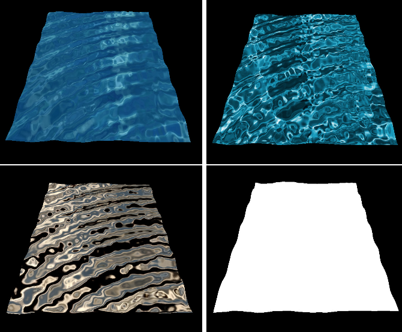
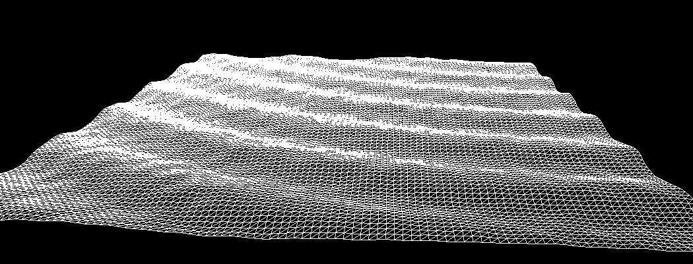
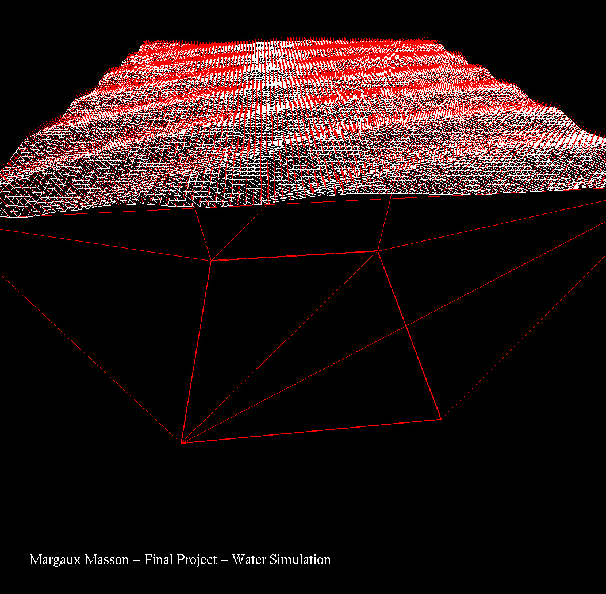
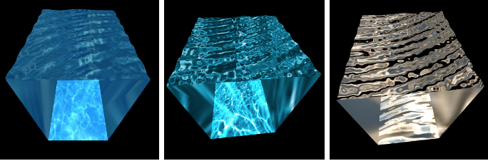
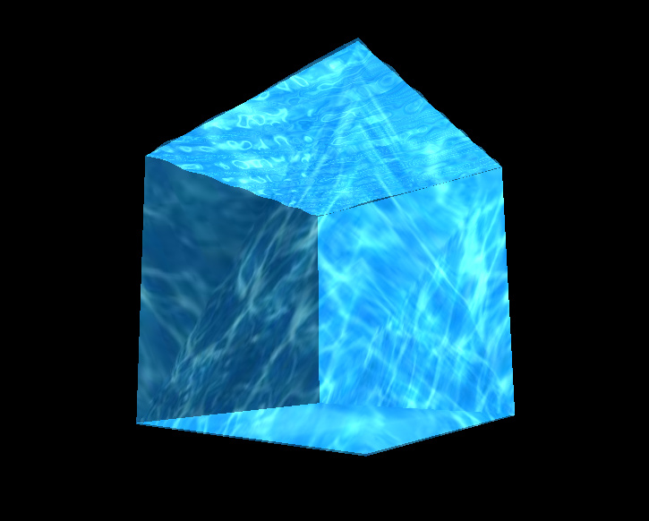
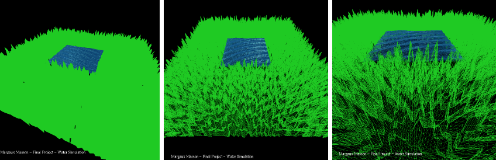

# Water Simulation openGL
## Introduction to Computer Graphics Final Project

This final project has for main purpose to apply all the techniques learned during this term. Therefore, I chose to implement some water/waves simulator using OpenGL. This project involves implementing and manipulating 3D surfaces and normals, openGL functions, mathematical equations, texturing, lighting, and more.

## Keyboard commands:

- p or P: Orthographic projection
- o or O: Perspective projection 
- f or F: Freeze or un-freeze the waves' animation 
- l or L: Display the wires 
- n or N: Display the normals
- t or T: Switch between the three textures (blue, deep blue, dark blue) and no texture 
- '+' and '-': Increase/Decrease intensity of the waves
- x or X: Rotate the scene around the X-axis
- y or Y: Rotate the scene around the Y-axis
- z or Z: Rotate the scene around the Z-axis
- a or A: Switch between cube scene and field (grass) landscape
- w or W: Simulate the water without unidirectional waves
- 0: Display only the water 
- q or Q: Quit the program

### Grass field - Additional study

